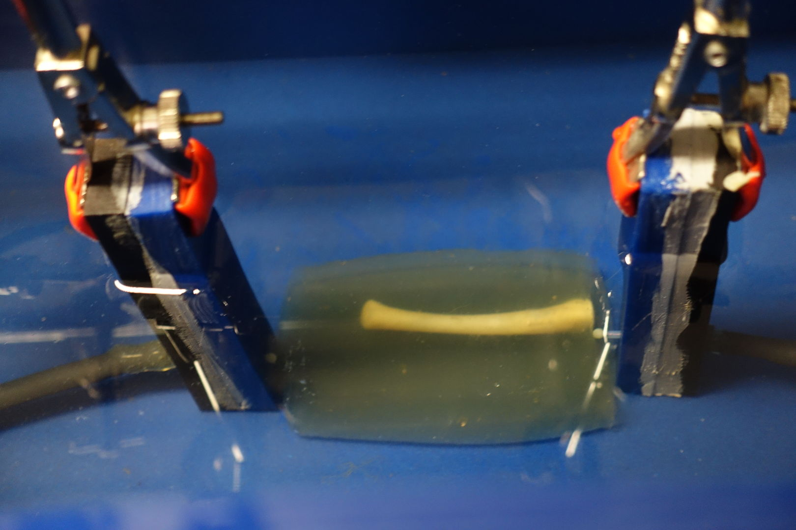

# USbodyComm Documentation

The USbodyComm repository provides finite impulse response (FIR) models of ultrasound in-body mimicking channels, measured on custom-made gelatin phantoms.

## Measurement campaign

1. First, different gelatin phantoms were fabricated by dissolving an appropriate volume of gelatin powder in hot water. The liquid gelatin was poured in molds of different **dimensions 40 mm x 40 mm x d mm** with d varying from 20, 40 and 80mm. When the liquid started solidifying, a selection of molds were inserted by a cleaned chicken bone. These chicken bones add more realism to the fabricated phantoms for ultrasound transmission testing.

2. Second, a custom-made ultrasound-anechoic water tank was constructed of dimensions 365 x 230 x 265 mm (WxHxD). The used absorbing material was [Aptflex F28](https://www.acoustics.co.uk/product/aptflex-f28/), which covered all 5 walls of the tank, as well as the supporting plates for the transducers. Additionally, the water surface was covered with a square piece of absorbing material suited to the transducer distance. In further photographs, this absorbing material can be seen by its blue appearance.

3. Third, the used ultrasound transducers were omni-directional radiating and have an approx. **130kHz BW response** at **1.2MHz center frequency**.

For more information regarding the setup or the measurement procedure, we refer to the accompanying paper:
T.Bos et al. "Enabling Ultrasound In-Body Communication: FIR Channel Models and QAM Experiments", *IEEE Transactions on Biomedical Circuits and Systems*, 2018 (Early Access) (DOI 10.1109/TBCAS.2018.2880878) ([ieee xplore](https://ieeexplore.ieee.org/document/8531730))

4. Fourth, each experiment contains **2x5 impulse responses**, which are split into two groups of 5 IRs that are 30s separated in time to assess the time stability of the static channels.

## Experiment categorization

There are 3 categories of experiments, each featuring a different *in-body communication concept*:
* **Characterisation** -- characterisation of the anechoic watertank. This provides the full electro-acoustic system response without any phantom present.
* **Implant2implant** -- through phantom measurement, while the phantom is submersed in the anechoic watertank. This mimics implant to implant communication.
* **Surface2surface** -- through phantom measurement, while phantom is surrounded by air. This mimics surface to surface communication.

Each such *communication concept* combines different experiments
where the *phantom-under-test*  is changed to test varying distances and
changing scattering materials (i.e. chicken bones).
Each experiment is represented by a unique name, with the following
convention:

`expName = <commConcept>_<phantom>_<distance>[_var<x>]`

Some experiments are repeated where the transducer positioning is slightly changed (order of mm) to test the robustness to small variations. These experiments are indicated by the optional `_var<x>` suffix.
Some examples of experiment names:
* The implant2implant measurement of the gelatin 80mm long phantom is given by: "impl2impl_gelatin_80".
* The characterisation measurement of the 40mm long water channel is: "charac_water_40".
* A small variation of the surface2surface measurement of the gelatin 80mm long phantom: "surf2surf_gelatin_80_var1".

A complete list of all experiments is provided further.

## Complete list of all provided FIRs

In total 26 experiments were carried out, each measuring 10 FIRs, which makes this repository contain a total of **260 impulse responses**. A complete list of all experiments is given below.

Experiment naming     |   Details       | Image |
-----------------     |   ------------ | ------------- |
***charac_water_<d\>***      |  Characterization measurements; d = 1, 20, 40, 80 mm |   
***impl2impl_gelatin_<d\>***   |  Implant2implant measurement pure gelatin phantoms; d = 20, 40 and 80 mm |    
*impl2impl_bone_80*        |  Bone-phantom 80mm long with the line-of-sight (LOS) positioned parallel to the bone; LOS is not blocked by bone |    
*impl2impl_bone_80_var1*    |  Variation: bone into the LOS; LOS is blocked by bone |
*impl2impl_bone_30*         |  Bone-phantom 30mm long, which in reality is the bone_80 phantom side-turned; LOS is blocked by bone |
***surf2surf_gelatin_80***      | Surface2surface measurement of 80mm long pure gelatin phantom |   
*surf2surf_gelatin_80_var<x\>*   |  Variations x = 1,2,3; each a slight repositioning of Tx/Rx transducers in the ultrasound gel blob
*surf2surf_gelatin_40*      | Surface2surface measurement of 40mm long pure gelatin phantom  | 
*surf2surf_gelatin_40_var<x\>* | Variations x = 1,2; each a slight repositioning of Tx/Rx transducers in the ultrasound gel blob
*surf2surf_gelatin_20*  | Surface2surface measurement of 20mm long pure gelatin phantom  | 
*surf2surf_gelatin_20_var1* | Variation: a slight repositioning of Rx transducers in the ultrasound gel blob |
*surf2surf_bone_80*   | Surface2surface measurement of 80mm long bone-phantom |
*surf2surf_bone_80_var<x\>* |  Variation x = 1,2,3; a slight repositioning of Rx transducers in the ultrasound gel blob |
*surf2surf_bone_40* | Surface2surface measurement of 40mm long bone-phantom, which in reality is bone_80 side-turned to the other, i.e. 40mm long, side |
*surf2surf_bone_40_var<x\>* | Variations x = 1,2; each a slight repositioning of Tx/Rx transducers in gel blob |
